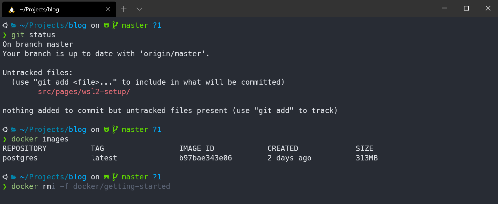

It's been a while since my last post! Actually I planned to write my next post about my side-project [retro](https://github.com/yduman/retro) when it is mature enough, but for now I wanted to share with you my recent WSL2 setup on my new workstation which was ridiculously easy to do!

## What I wanted

Basically I wanted the same setup that I would run on my MacBook and my Linux machines:

- A configurable terminal similar to [iTerm2](https://www.iterm2.com/) or [Tilix](https://gnunn1.github.io/tilix-web/)
- ZSH shell with [oh-my-zsh](https://ohmyz.sh/)
- [Powerlevel10k](https://github.com/romkatv/powerlevel10k) theme
- Docker and VS Code support

## What you can expect

In the following, I will guide you step by step on how I did my setup.
Your end result might look like this for example:



As you can see, the shell runs inside Windows Terminal with the Powerlevel10k theme, syntax highlighting, automatic suggestions and Docker.

### Prerequisites

You will need the Windows 2004 update and you have to enable virtualization on your BIOS.

### Step 1: Install WSL2

- Basically, you have to follow [these](https://docs.microsoft.com/en-us/windows/wsl/install-win10) steps from the Microsoft Docs 
- Here are the necessary steps, if you have a fresh installation of Windows 2004:

Open PowerShell as Administrator and run the following commands:

```powershell
# Install WSL
dism.exe /online /enable-feature /featurename:Microsoft-Windows-Subsystem-Linux /all /norestart

# Enable Virtual Machine Platform
dism.exe /online /enable-feature /featurename:VirtualMachinePlatform /all /norestart
```

After these two commands, restart your machine and run the next command to set WSL2 as your default version:

```powershell
# Use WSL2 per default
wsl --set-default-version 2
```

### Step 2: Install a Linux Distribution and Windows Terminal

- Visit the Windows Store and install your desired Linux distribution and Windows Terminal. I chose the latest LTS version of Ubuntu for example, which is currently Ubuntu 20.04

- After installing your distribution you have to launch it and it will ask you for a username and password

### Step 4: Configure Windows Terminal

- Open Windows Terminal and open the settings with the `Ctrl + ,` shortcut. You should see the file `settings.json`
- I wanted WSL2 to be my main profile. You can achieve this by copying the `guid` value of your Linux distribution into `defaultProfile`
- After that I wanted a better colorscheme than the default one. There are some pre-defined ones that you can select from [here](https://docs.microsoft.com/en-US/windows/terminal/customize-settings/color-schemes)
- The colorscheme on the screenshot is called `One Half Dark`. To add a colorscheme, expand the profile configuration of your distribution with the key `colorScheme` and the value of the theme name as a string
- Next thing for me was to change the starting directory to my Linux home directory. For that, expand the profile object with `"commandline": "wsl.exe ~"`
- Lastly, since I wanted to use Powerlevel10k, I had to install their [recommended](https://github.com/romkatv/powerlevel10k#meslo-nerd-font-patched-for-powerlevel10k) font `MesloLGS NF`. After installing, expand your profile object with `"fontFace": "MesloLGS NF"`

Ultimately, you should have an object similar to this:

```json
{
    "guid": "{some-value}",
    "hidden": false,
    "name": "Ubuntu-20.04",
    "source": "Windows.Terminal.Wsl",
    "colorScheme": "One Half Dark",
    "fontFace": "MesloLGS NF",
    "commandline": "wsl.exe ~"
}
```

### Step 5: Install oh-my-zsh

Run these commands:

```bash
$ sudo apt install zsh
$ sh -c "$(curl -fsSL https://raw.github.com/ohmyzsh/ohmyzsh/master/tools/install.sh)"
```

You may want to restart Windows Terminal for a new session.

### Step 6: Install useful plugins and configure ZSH

- [zsh-autosuggestions](https://github.com/zsh-users/zsh-autosuggestions)
- [zsh-syntax-highlighting](https://github.com/zsh-users/zsh-syntax-highlighting)

```bash
$ git clone https://github.com/zsh-users/zsh-autosuggestions ${ZSH_CUSTOM:-~/.oh-my-zsh/custom}/plugins/zsh-autosuggestions
$ git clone https://github.com/zsh-users/zsh-syntax-highlighting.git ${ZSH_CUSTOM:-~/.oh-my-zsh/custom}/plugins/zsh-syntax-highlighting
$ git clone --depth=1 https://github.com/romkatv/powerlevel10k.git ${ZSH_CUSTOM:-~/.oh-my-zsh/custom}/themes/powerlevel10k
```

Open `~/.zshrc` and modify its content like this:

```
# Use Powerlevel10k theme
ZSH_THEME="powerlevel10k/powerlevel10k"

# Use plugins
plugins=(docker zsh-autosuggestions zsh-syntax-highlighting)
```

After setting the theme, the Powerlevel10k wizard should show up, which will guide you through the setup. If it did not show up then try to run `p10k configure`. More about [oh-my-zsh plugins](https://github.com/ohmyzsh/ohmyzsh/wiki/Plugins) and [Powerlevel10k configuration](https://github.com/romkatv/powerlevel10k#configuration).

### Step 7: Docker and VS Code

Docker also supports Windows Home since the 2004 update! Follow their guideline [Install Docker Desktop on Windows Home](https://docs.docker.com/docker-for-windows/install-windows-home/). After the installation Docker should automatically use the WSL2 backend. That was at least the case for me. If it wasn't for you, then please follow this [documentation](https://docs.docker.com/docker-for-windows/wsl/).

VS Code has of course great support for development inside WSL2 with this [extension](https://marketplace.visualstudio.com/items?itemName=ms-vscode-remote.remote-wsl). The README should be sufficient documentation.

## And we're done 🎉

With this setup you should have a full-blown development setup inside WSL2 and a nice looking Windows Terminal. I am very pleased with this setup and since the last years Microsoft keeps surprising me everytime! 

I feel like these times...


...are over.